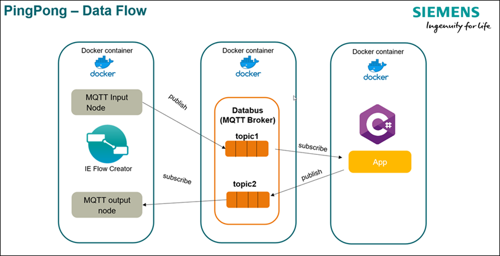
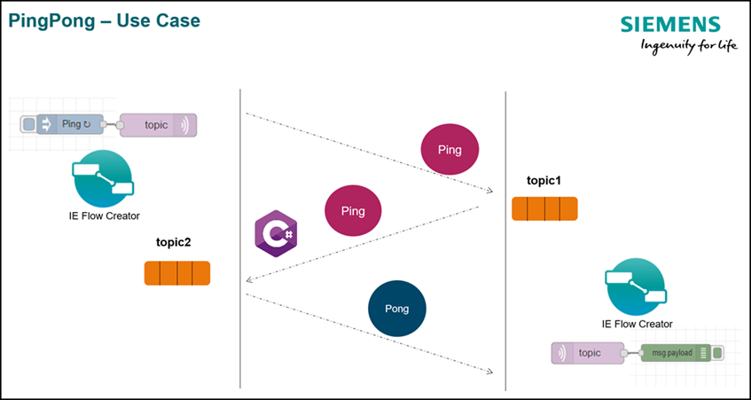

# Databus Ping Pong C#

This repository contains the source files to build the Databus Ping Pong application example implemented in C#.

- [Databus Ping Pong C#](#databus-ping-pong-csharp)
  - [Description](#description)
    - [Overview](#overview)
    - [General task](#general-task)
  - [Requirements](#requirements)
    - [Used components](#used-components)
    - [Further requirements](#further-requirements)
  - [Installation](#installation)
  - [Usage](#usage)
  - [Documentation](#documentation)
  - [Contribution](#contribution)
  - [Licence and Legal Information](#licence-and-legal-information)

## Description

### Overview

This application example shows how to connect to the IE Databus and how to send and receive data via the IE Databus using an implementation in C#.
The IE Flow Creator is used to exchange data with another app using the IE Databus as the MQTT broker.

The application example uses a multi-stage process for building the docker image to keep the image size as small as possible. The two ``FROM`` Statements in the [Dockerfile](src/Dockerfile) separate the build process into two stages. 
The fist one is compiling the source code to a executable which then gets copied to the second stage which will be the final image for the application. Please refer to the the [docker documentation](https://docs.docker.com/develop/develop-images/multistage-build/) for more information regarding multi-stage builds.

### General task

The application subscribes to one topic of the IE Databus and waits to receive data. When data arrives, it publishes a corresponding answer to a second topic of the IE Databus. If it receives the string "Ping", it will answer with "Pong" and the other way around.

The two topics and the databus user have to be created in the IE Databus in advance. The name of the two topics as well as the databus credentials used by the application can be configured via environmental variables or via an external configuration file created in the Industrial Edge Management.

## Requirements

### Used components

- Industrial Edge Management V 1.1.16
  - IE Databus V1.1.23
  - IE Databus Configurator V1.1.24
  - IE Flow Creator V 1.0.5
- Industrial Edge Device V 1.1.0-59
- Industrial Edge App Publisher V1.1.4
- Docker Engine V20.10.3
- Docker Compose V1.28.5

### Further requirements

- IE Device is onboarded to a IE Management
- IE Databus Configurator is deployed to the IE Management
- IE Databus is deployed to the IE Device
- IE Flow Creator is deployed to the IE Device

## Installation

Please refer to the [Installation](docs/Installation.md) documentation.

## Usage

Once the applciation is successfully deployed, it can be tested using the IE Flow Creator.

Please refer to [Testing the application using Simatic Flow Creator](docs/Installation.md#testing-the-application-using-simatic-flow-creator)
how to use it.

## Documentation
  
You can find further documentation and help in the following links
  - [Industrial Edge Hub](https://iehub.eu1.edge.siemens.cloud/#/documentation)
  - [Industrial Edge Forum](https://www.siemens.com/industrial-edge-forum)
  - [Industrial Edge landing page](https://new.siemens.com/global/en/products/automation/topic-areas/industrial-edge/simatic-edge.html)
  - [Industrial Edge GitHub page](https://github.com/industrial-edge)
  
## Contribution

Thanks for your interest in contributing. Anybody is free to report bugs, unclear documentation, and other problems regarding this repository in the Issues section or, even better, is free to propose any changes to this repository using Merge Requests.

## Licence and Legal Information

Please read the [Legal information](LICENSE.md).
